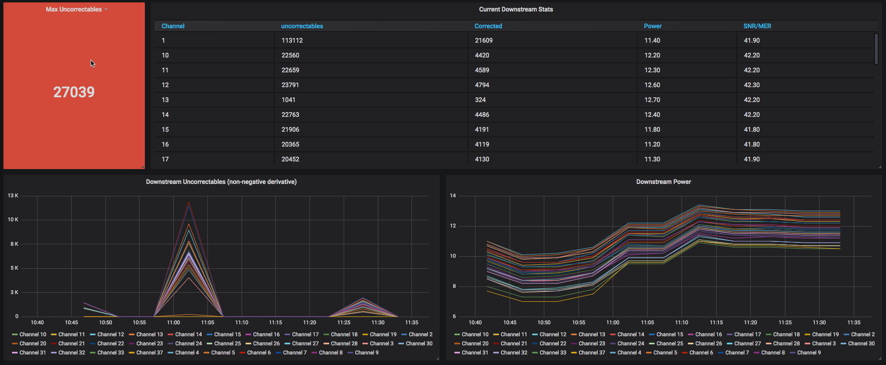
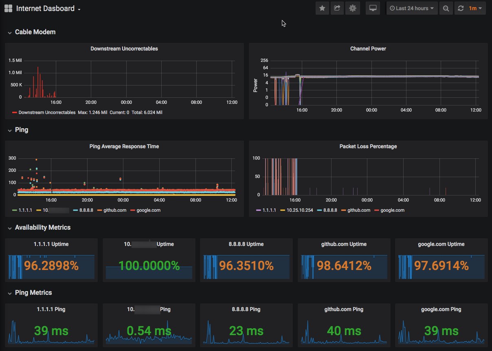

# arris_cable_modem_stats

This is a Python script to scrape stats from the Arris cable modem web interface.  Results are meant to be sent to InfluxDB for use with Grafana, but other targets could be added.  This currently only works with the Arris SB8200.  Credit goes to https://github.com/billimek/SB6183-stats-for-influxdb


## Run Locally

- Install [pipenv](https://github.com/pypa/pipenv). On a Mac with Homebrew, ```brew install pipenv```
- Install pip dependencies (from the root of this repo): ```pipenv install```
- Edit config.ini and change [INFLUXDB] host to your influxdb server
- ```pipenv run python3 arris_stats.py```


### Debugging
```pipenv run python3 sb8200_stats.py  --debug```

## InfluxDB
The database will be created automatically if the user has permissions (config.ini defaults to anonymous access).  You can set the database name in config.ini using the [INFLUXDB] database parameter.

## Grafana

There are two Grafana examples.  The first only relies on the Python script from this repo, while the second relies on [Telegraf](https://www.influxdata.com/time-series-platform/telegraf/).

### SB8200 Dashboard

- Setup arrris_stats.py to run from somewhere (There's a Docker example below)
- Import a new dashboard using the [grafana/sb8200_grafana.json](grafana/sb8200_grafana.json) file.  Originally exported from Grafana v6.3.3




### Internet Uptime Dashboard

- Install [Telegraf](https://www.influxdata.com/time-series-platform/telegraf/) on your InfluxDB system (or on a separate server/container)
- Drop [influxdb/telegraph_internet_uptime.conf](influxdb/telegraph_internet_uptime.conf) into ```/etc/telegraf/telegraf.d/```  (customize IPs/hosts to your liking)
- Restart/reload Telegraf
- Import [grafana/internet_uptime.json](grafana/internet_uptime.json) into Grafana




## Docker
Run in a Docker container with:

    docker build -t arris_stats .
    docker run arris_stats


